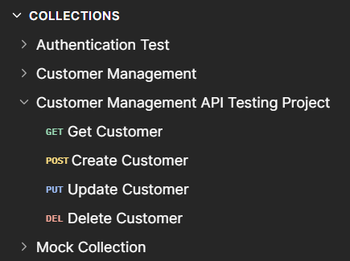
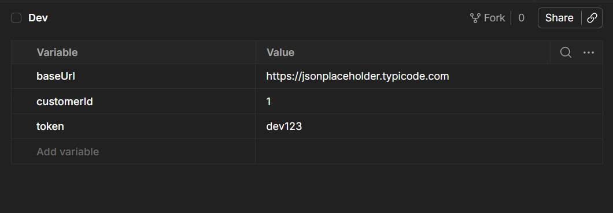

# Customer Management API Testing Project

## Overview

This project demonstrates API Testing using Postman.

It covers:

- GET Requests
- POST Requests
- PUT Requests
- DELETE Requests
- Authentication
- Variables
- Environments
- Collections
- Test Scripts
- Assertions

## Tools Used

- Postman
- REST APIs
- JSONPlaceholder

## Test Scenarios Covered

### GET Customer
- Status Code Validation
- Response Time Validation
- Field Existence Validation
- User ID Validation

### Create Customer
- Status Code Validation

### Update Customer
- Status Code Validation

### Delete Customer
- Successful Delete Validation

## Environment Variables

- baseUrl
- customerId
- token

## Authentication

Bearer Token Authentication using Postman Collection level configuration.

## Collection Structure

## Environment Configuration

## Authentication

## Test Results

## Author

Vaidheki SV
